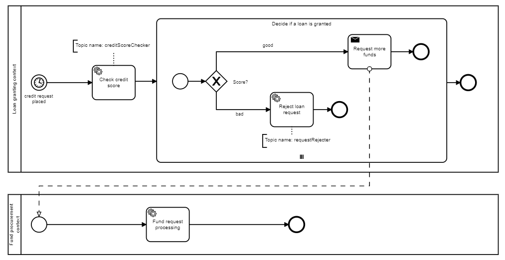
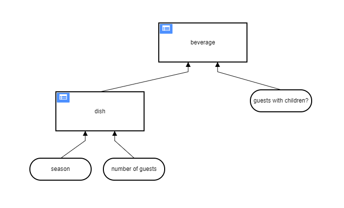
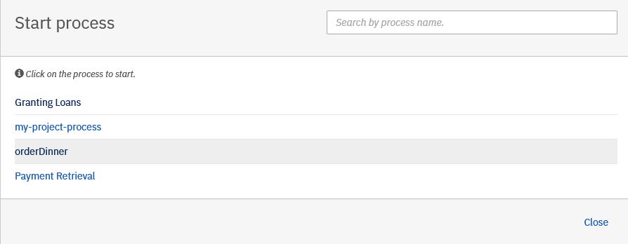
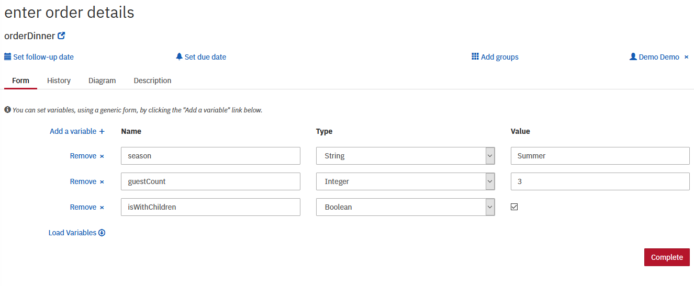
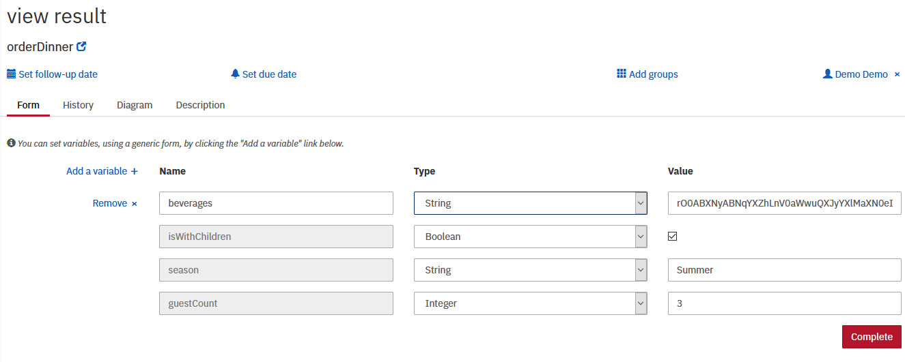

## Prerequisites (for bpmn diagrams inspection)
* [Java JDK 8+](http://www.oracle.com/technetwork/java/javase/downloads/jdk8-downloads-2133151.html)
* [Apache Maven](https://maven.apache.org/download.cgi)
* [Camunda Modeler](https://camunda.com/download/modeler/)

## Start the Camunda Platform Runtime (spring boot application)
* execute mvn clean install (root directory)
* run engine application 
```
java -jar engine/target/engine-1.0.0-SNAPSHOT.jar
```
* run worker application 
```
java -jar client/target/spring-charge-card-worker-0.0.1-SNAPSHOT.jar
```
* for bpm inspection import the bpmn diagrams into the modeller
```
engine\src\main\resources\payment-retrieval.bpmn
engine\src\main\resources\loan-granting.bpmn
```
* in order to trigger the payment-approval process execute the following curl:
```
curl --location --request POST 'http://localhost:8080/engine-rest/process-definition/key/payment-retrieval/start' \
--header 'Content-Type: application/json' \
--data-raw '{
    "variables": {
        "amount": {
            "value": 6666,
            "type": "long"
        },
        "item": {
            "value": "efe9f59c-ba28-11eb-8529-0242ac130003"
        },
        "sid": {
            "value": "S-1-5-21-1085031214-1563985344-725345543"
        },
        "token": {
            "value": "e250cdd4-ba28-11eb-8529-0242ac130003"
        }
    }
}'
```
## BPMN sample#2
dmn tables:
<br/>


execute both applications and proceed to http://localhost:8080/camunda/app/cockpit/default/#/processes
observe the console output

## DMN sample
dmn tables:
<br/>


* create decision evaluation process:<br/>



* provide input:<br/>



* view results:<br/>

